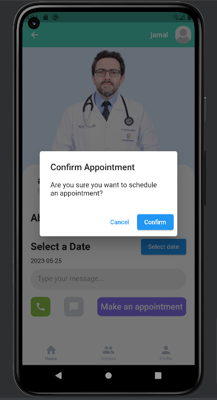
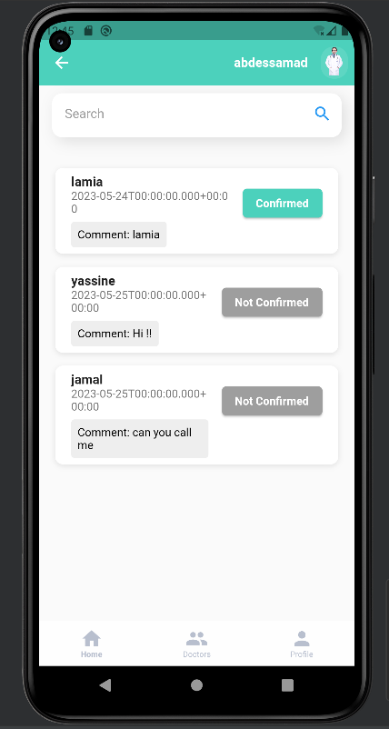
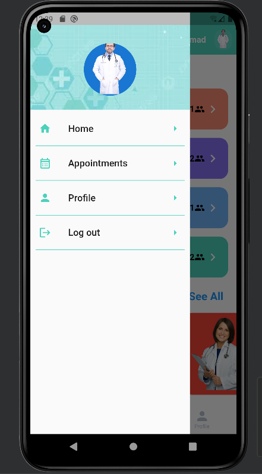
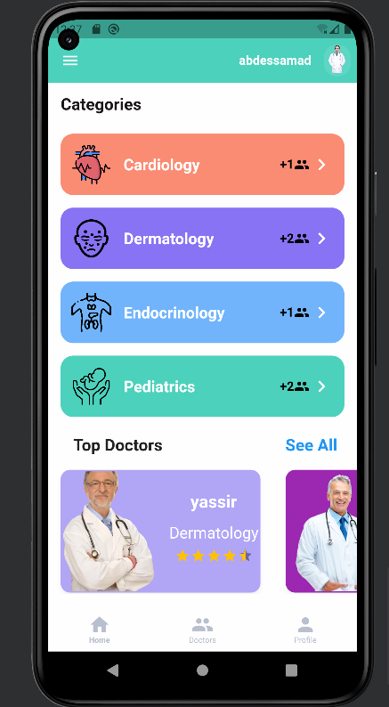
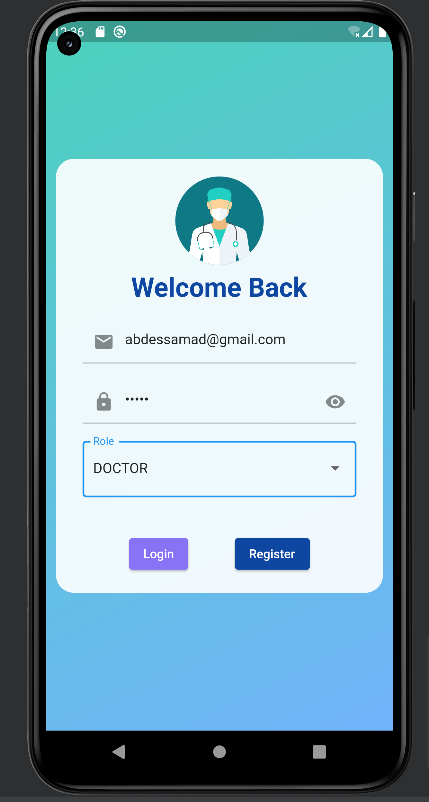
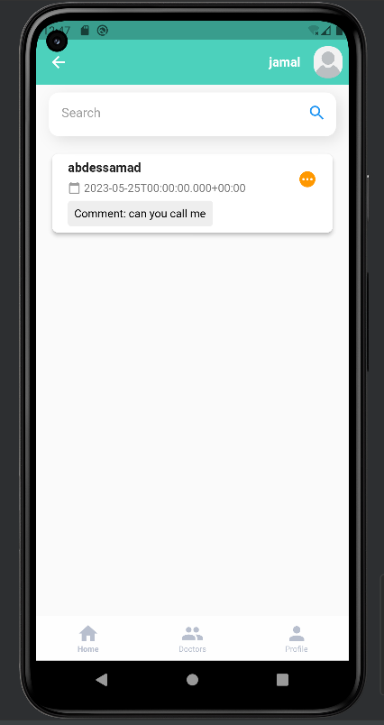
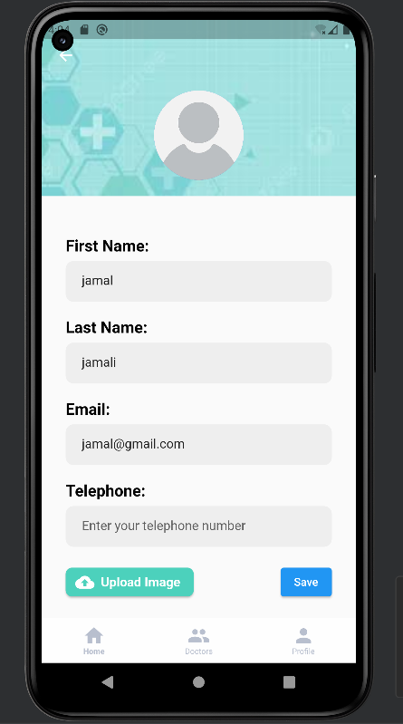
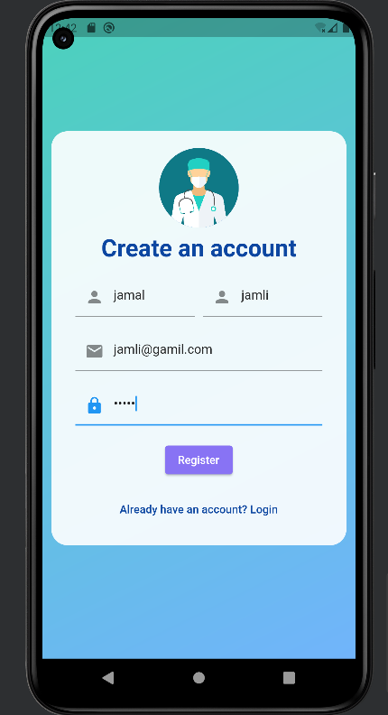

# Health Connect App

Health Connect is a revolutionary mobile app developed with Flutter that aims to transform the way patients connect with doctors. Our platform leverages the power of technology to provide a seamless experience for patients to find specialized doctors based on their specific diseases and make appointments with ease.

## Features

- **Hassle-free Appointments:** Say goodbye to long waiting times! Our app enables patients to schedule appointments with their preferred doctors in just a few taps.

- **Enhanced Security:** We prioritize the privacy and confidentiality of patient data. We have implemented the latest industry-standard security measures using Spring Boot and Spring Security to ensure enhanced data protection.

- **Seamless User Experience:** Thanks to our utilization of Flutter and Dart, the app offers a sleek and intuitive interface, making it a breeze for patients to navigate and access vital information.

## Screenshots

## Installation

1. Clone the repository: `git clone https://github.com/YourUsername/Health-Connect.git`
2. Navigate to the project directory: `cd Health-Connect`
3. Install the necessary dependencies: `flutter pub get`
4. Run the app on your emulator or device: `flutter run`

## Technologies Used

- Flutter
- Dart
- Spring Boot
- Spring Security

## Contributing

We welcome contributions from everyone! If you would like to contribute to this project, please follow these steps:

1. Fork the repository.
2. Create a new branch for your contribution: `git checkout -b feature/your-feature`
3. Commit your changes: `git commit -m "Add your feature"`
4. Push to the branch: `git push origin feature/your-feature`
5. Open a pull request.

## License

This project is licensed under the [MIT License](LICENSE).
